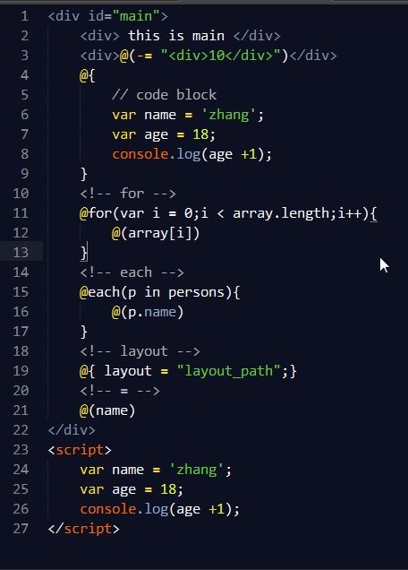

#razor.sublime-package

[razor-tmpl](https://github.com/magicdawn/razor-tmpl) syntax definition & snippet for Sublime Text 3 or 2(not tested)

#download
`razor-tmpl` for `Package Control`

#usage
just use `.razor` as your template file ext,exmaple `index.razor`
or you can use `set syntax razor`

#snippet
- `for`	->	`@for(...)`
- `each`	->	`@each(item in items`
- `layout`->	`@{ layout = "layout_path"; }`
- `include`	->	`@include("to_be_included")`
- `=`	->	`@(variable_or_expression)`

the `tab_trigger` means : 
if you tap `for` and press the `Tab` button,then
```js
@for(var i = 0;i < Things.length;i++){
	@(Things[i])
}
```
displayed


#Screenshot
